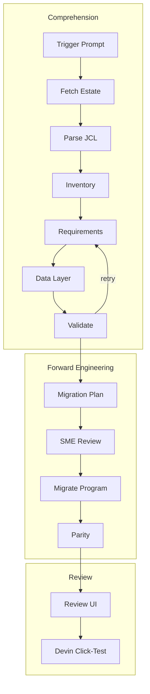

# COBOL Batch Modernization Demo

View the [standalone flowchart](docs/flowchart.html) or [PNG](docs/flowchart.png).

## What this demo shows

This is a backend-only modernization demo for a z/OS COBOL batch estate. It turns a real JCL →
PROC → COBOL → Db2 chain into schema-constrained stream inventory, functional and nonfunctional
requirements, data-layer mappings, a migration plan, and a three-leg parity report. The shipped
settlement stream is the evidence-backed reference example; no migrated business code is shipped.

The upstream `cloudframe-samples/cloudframe-mainframe-modernization-tradingapp` estate is
Apache-2.0 licensed and pinned to `d1450ca062445a6e70f2a2638af6ba286ca8fecc`. It is fetched into
`legacy/` at runtime and is not vendored in this repository.

## What Devin does live

Devin fetches the pinned estate, decomposes the acceptance/matching stream, regenerates
DCLGEN-shaped members from the shipped catalog DDL, derives artifacts with line-level evidence,
runs the validator feedback loop, plans a migration, migrates one program, executes the parity
harness, rebuilds the review UI, and click-tests the UI in its own browser. Generated DCLGEN
members are derived layouts, not transcribed customer PDS members; production migration confirms
them against the customer's DCLGEN PDS and scale metadata.
The UI is a generated evidence viewer, not a business application.

## How the live demo is triggered and run

The presenter starts a Devin session with a modernization prompt naming the acceptance/matching
stream (`ACCP<CUR>` → `TRDPROC` → `TRDPB000`). Devin is the runtime: it executes the deterministic
commands and displays the generated review UI through Devin's browser/Desktop tab. For local
development only, the equivalent commands are `make fetch`, `make dclgen`, `make validate`,
`make parity`, `make report`, `make test`, and `make serve`.

## Repo layout

* `legacy/` — gitignored pinned upstream estate fetched by `make fetch`
* `schemas/` — customer-editable contracts and OEM profile
* `artifacts/reference-example/` — hand-derived settlement gold artifacts
* `artifacts/generated/` — live-session output location
* `harness/fixtures/` — committed three-leg parity inputs
* `tools/` — fetch, DCLGEN generation, validation, normalization, parity, and report generation
* `docs/` — implementation plan, framework mapping, and flowchart
* `tests/` — Python and Playwright verification

## Key concepts

* **EARS** constrains requirements into ubiquitous, state-driven, event-driven, optional-feature,
  unwanted-behaviour, and complex patterns.
* **ISO 25010** gives NFRs a quality-characteristic/subcharacteristic pair and measurable oracle.
* **Migration categories** are foundation, like-to-like, new design, and depend-on-new.
* **Three-leg parity** compares expected semantics, supplied legacy execution, and target execution.
* **Evidence-hash gate** hashes the exact fetched source line span so fabricated citations fail.
